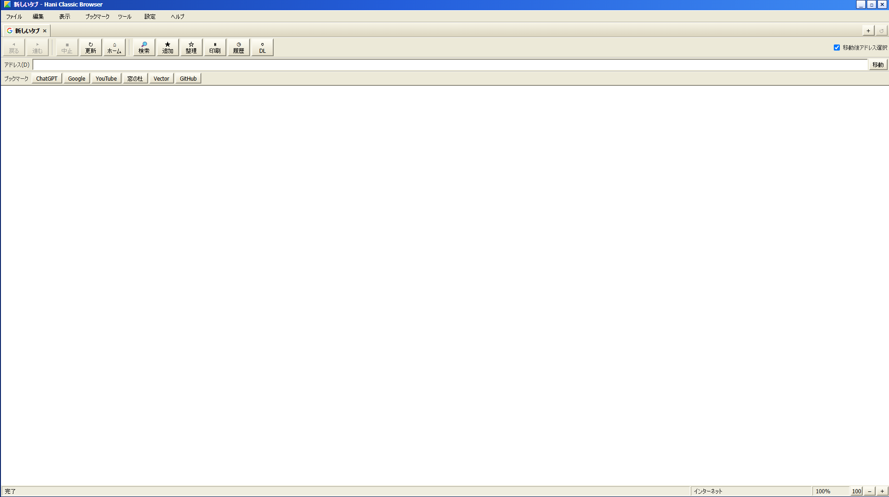

# win11でxpごっこ
2026-06-03 / 配布

win11でxpごっこしたかった。

した

## タスクバー及びスタートメニューの変更
[RetroBar](https://github.com/dremin/RetroBar/releases)を使った。
こんな感じで設定する

終わるとこんな感じ

## ウィンドウの変更

[WindowBlinds](https://www.stardock.com/products/windowblinds/)を使った。
有料だけど30日間は無料で使えるよ。~~どうせ30日で飽きるから問題ないよね！~~

設定から、テーマを「Windows XP Luna」にする。

終わるとこんな感じ

なんとchrome等独自のウィンドウをもつアプリには適応されないので、ブラウザは普通の見た目のまま。

しかもwin標準の設定画面は上が潰れて検索バーが消える。

~~これで5000円ですか？~~

## XPっぽいブラウザをつくる
Electron使って。

これをかぶせて。

完成！！ちなみにブラウザは[配布中]()です。

## 終わり
完成したのがこれ。

win11のUIは使いやすいなと思いました(小並感)

---

[日記一覧へ戻る](index.md)  
[トップへ戻る](/index.md)
